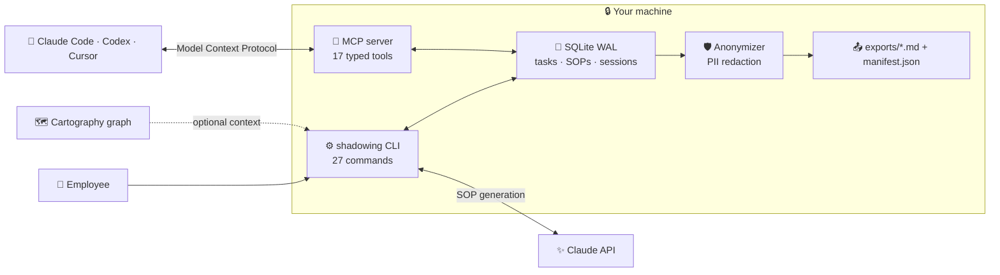

<div align="center">


# Datasynx Shadowing · `shadowing`

### The SOPs your team never has time to write.

**Local-first. MCP-native. Claude-powered.**
Shadowing observes daily workflows like a silent shadow — shell commands, active windows, git commits, file changes — and automatically generates anonymized Standard Operating Procedures (SOPs) via Claude. Fully local, fully anonymized.

<p>
<a href="#-quick-start"><strong>Quickstart</strong></a> · <a href="https://datasynx.github.io/agentic-ai-shadowing/"><strong>Docs</strong></a> · <a href="https://www.npmjs.com/package/@datasynx/agentic-ai-shadowing"><strong>npm</strong></a> · <a href="https://github.com/datasynx/agentic-ai-shadowing"><strong>GitHub</strong></a> · <a href="https://www.linkedin.com/company/datasynx-ai/"><strong>LinkedIn</strong></a>
</p>

[](https://www.npmjs.com/package/@datasynx/agentic-ai-shadowing)
[](https://www.npmjs.com/package/@datasynx/agentic-ai-shadowing)
[](https://github.com/datasynx/agentic-ai-shadowing/actions/workflows/ci.yml)
[](https://datasynx.github.io/agentic-ai-shadowing/)
[](https://github.com/datasynx/agentic-ai-shadowing/stargazers)
[](./LICENSE)
[](https://nodejs.org)
[](https://docs.anthropic.com)
[](https://github.com/datasynx/agentic-ai-shadowing/actions/workflows/ci.yml)

</div>

---

| Without                                                                       | With                                                                                                |
| ----------------------------------------------------------------------------- | --------------------------------------------------------------------------------------------------- |
| ❌ SOPs are written from memory weeks later — if they're written at all.       | ✅ The procedure is captured *as the work happens*. Claude turns it into a structured SOP on demand. |
| ❌ Tribal knowledge walks out the door when someone leaves.                    | ✅ Every recurring task becomes a versioned, reviewable, exportable SOP.                             |
| ❌ A monitoring SaaS ships your screen activity to someone else's cloud.        | ✅ 100% local — SQLite on the employee's machine. No cloud, no daemon, no telemetry.                |
| ❌ Exports leak emails, IPs, IBANs, and file paths into shared docs.           | ✅ Every export is automatically PII-scrubbed — and you can preview the redaction first.            |
| ❌ "Is this SOP still accurate?" — nobody knows.                               | ✅ Consistency, maturity, and freshness scores flag which SOPs have gone stale.                     |
| ❌ Switch to a separate tool to update a procedure.                            | ✅ Your agent drives it in place via MCP, from inside Claude Code / Codex / Cursor.                 |

---

## What it does

```
$ shadowing start

  Agentic AI Shadowing — Active

? Start a new task? Yes
? Task title: Monthly SAP Closing
? Short description: Monthly closing tasks in SAP FI

  Task started: "Monthly SAP Closing" (ID: a3f8c210)

? What would you like to do?
  > Complete task → Generate SOP
    Pause task
    Add note to current step
    End shadowing

? How complex was this task? 3 - Medium

  Task completed. Duration: 1h 23min 45s
  Generating SOP...

  SOP generated!
  +-------------------------------------------------+
  |  Monthly SAP Closing — Standard Operating       |
  |  Procedure                                      |
  |  Tags: #accounting #sap #monthly                |
  |  Steps: 8                                       |
  +-------------------------------------------------+
```

```
$ shadowing observe --auto-sop

  Observation started (Session: b7e2f4a1)
  Sources: Windows · Shell History · Git
  Auto-SOP: enabled

  [14:23:01] Window  VS Code — src/api/routes.ts
  [14:23:45] Shell   git diff src/api/routes.ts
  [14:24:12] Shell   npm run test
  [14:31:00] Window  Chrome — Jira Board
  [14:35:22] Shell   git commit -m "fix: validate input"
  [14:35:30] Shell   git push origin feature/validation

  Observation ended. 2 tasks detected → 2 SOPs generated.
```

---

## Why it's different

- **Local-first by default** — a SQLite database on the employee's machine. No cloud sync, no background daemon, no telemetry. The only outbound call is to the Claude API for SOP generation.
- **Employee-driven** — the person doing the work starts, pauses, and completes tasks. Nothing is captured without consent and exclusion rules.
- **Anonymized at the boundary** — exports run through a PII redactor (emails, IPs, URLs, phones, file paths — plus always-on IBAN / credit-card / tax-ID / SSN scrubbing).
- **MCP-native, not bolted-on** — a 17-tool MCP server lets Claude Code, Codex, and Cursor drive Shadowing directly.
- **Quality you can measure** — consistency, maturity, and freshness scores tell you which SOPs are trustworthy and which have gone stale.
- **MIT-licensed TypeScript** — strict, ESM-only, fully typed, and extensible.

---

## Architecture



---

## Features

| Feature | Details |
|---------|---------|
| **Automatic Observation** | Shell history, active windows, git commits, and file changes — cross-platform |
| **AI SOP Generation** | Claude generates structured SOPs with goal, prerequisites, steps, expected results |
| **Enterprise Dashboard** | Dark-theme web dashboard with SOP editor, metrics, diff viewer, export workflow |
| **Quality Metrics** | Consistency, maturity, freshness, and overall score per SOP |
| **PII Anonymization** | Email, IP, URL, phone, file paths, IBAN, credit cards, tax ID, social security number |
| **Version History** | Every SOP change is versioned with diff view |
| **Claude Code Integration** | MCP server (18 tools) + hook handler for seamless IDE integration |
| **Cartography Context** | System landscape from [@datasynx/agentic-ai-cartography](https://github.com/datasynx/agentic-ai-cartography) feeds into SOP generation |
| **Privacy First** | Consent management, exclusion rules, configurable anonymization |
| **100% Local** | SQLite DB, no cloud sync, no daemon — the employee controls everything |

---

## Cross-Platform Support

Shadowing detects windows and shell history natively on **Linux**, **macOS**, and **Windows**.

| Capability | Linux | macOS | Windows |
|---|---|---|---|
| **Window Detection** | `xdotool` (X11) | `osascript` (AppleScript) | PowerShell P/Invoke (`user32.dll`) |
| **Shell History** | Zsh extended, Bash timestamps | Zsh extended, Bash timestamps | PSReadLine ConsoleHost_history |
| **Git Tracking** | `git log` | `git log` | `git log` |
| **File Watching** | `fs.stat` | `fs.stat` | `fs.stat` |
| **Shell Detection** | `$SHELL` | `$SHELL` | `$MSYSTEM` / PowerShell fallback |

### Shell History Parser

| Shell | Format | Timestamps |
|-------|--------|-----------|
| **Zsh** | Extended (`: timestamp:duration;command`) | Exact |
| **Bash** | `#timestamp` + command lines | Exact |
| **Fish** | YAML-like (`- cmd:` / `when:`) | Exact |
| **PowerShell** | PSReadLine `ConsoleHost_history.txt` | Read time |

---

## Requirements

- **Node.js >= 22.12** (Linux, macOS, or Windows)
- **`ANTHROPIC_API_KEY`** environment variable — required **only for SOP generation**. Task tracking, observation, export, the dashboard, and metrics all work without it; you only need a key when you ask Claude to turn a task into an SOP.
- **[@datasynx/agentic-ai-cartography](https://github.com/datasynx/agentic-ai-cartography)** (optional, for infrastructure context)

```bash
export ANTHROPIC_API_KEY=sk-ant-...
```

### Environment variables

| Variable | Effect |
|----------|--------|
| `ANTHROPIC_API_KEY` | Claude API key, used for SOP generation and session analysis |
| `SHADOWING_UI_TOKEN` | Fixed Bearer token for the dashboard/REST API (otherwise a random one is generated per run) |
| `LOG_LEVEL` | `debug` / `info` / `warn` / `error`. The CLI defaults to `warn`; set `info` or `debug` to see diagnostic logs |
| `LOG_FORMAT` | Set to `json` for structured NDJSON logs |

---

## Install

```bash
npm install -g @datasynx/agentic-ai-shadowing
```

[](https://www.npmjs.com/package/@datasynx/agentic-ai-shadowing)

---

## 🚀 Quick Start

```bash
# 1. Setup (create DB + config)
shadowing init

# 2. Manual mode: start task → generate SOP
shadowing start

# 3. Automatic mode: observe workflow → auto-generate SOPs
shadowing observe --auto-sop

# 4. View SOPs
shadowing list
shadowing show <sop-id>

# 5. Start web dashboard
shadowing ui

# 6. Export with anonymization
shadowing export --all
```

> **Optional:** Install [Cartography](https://www.npmjs.com/package/@datasynx/agentic-ai-cartography) and run `shadowing import-graph ./cartography-graph.jgf.json` to fold your system landscape into generated SOPs.

---

## Commands

### Task Management

```
shadowing init                          Initial setup (DB + config)
shadowing start                         Start interactive shadowing mode
shadowing status                        Show current task and statistics
```

### SOP Management

```
shadowing list [options]                List SOPs
  --status <status>                       Filter: draft/reviewed/approved/exported/archived
  --tag <tag>                             Filter: tag name
  --search <query>                        Full-text search

shadowing show <sop-id>                 Display SOP in terminal
shadowing edit <sop-id>                 Edit SOP in default editor
shadowing delete <sop-id>               Permanently delete SOP
shadowing history <sop-id>              Show version history
shadowing diff <sop-id> [version]       Diff between versions
shadowing tag <sop-id> <tags...>        Add (+tag) / remove (-tag) tags
```

Add and remove tags in one call — prefix with `+` to add, `-` to remove:

```bash
shadowing tag a3f8c210 +monthly +finance   # add two tags
shadowing tag a3f8c210 -finance            # remove one tag
```

### Automatic Observation

```
shadowing observe [options]             Start observation mode
  --auto-sop                              Auto-generate SOPs after stop
  --no-window                             Without window detection
  --no-shell                              Without shell history tracking
  --watch-files [dir]                     Watch a directory for file changes
                                          (off by default; requires "file" consent;
                                          .git/node_modules + exclusion rules filtered,
                                          events debounced and buffer-capped)

shadowing sessions                      List observation sessions
shadowing timeline [session-id]         Show session timeline
shadowing analyze [session-id]          Session → detect tasks → generate SOPs
```

`analyze` also prints heuristic **task-boundary suggestions** (idle gaps ≥ 15 min,
git branch switches, directory changes) — hints for review, never silent splits.

### Metrics & Export

```
shadowing stats                         Metrics dashboard in terminal
shadowing export                        Interactive export wizard
shadowing export --all                  Export all approved SOPs
shadowing ui [--port <n>]               Start web dashboard (default: 3847)
```

### Publish into agent context

```
shadowing publish <sop-id>              Publish an APPROVED SOP as a skill
  --as <skill|agents-md>                SKILL.md directory or AGENTS.md index section
  --target <claude|agents|hermes>       Skill root(s): .claude/skills, .agents/skills, ~/.hermes/skills
  --dry-run / --yes                     Preview diff / skip confirmation
```

Skills follow the [agentskills.io](https://agentskills.io) standard (readable by
Claude Code, Codex, OpenClaw, Hermes). Hard rules: only `approved` SOPs are
eligible, content is anonymized again before writing, concrete literals (ports,
branch names) are lifted into `{{variables}}` with a parameters table, and the
write **always** shows a diff and asks first — generated content never reaches
agent context silently. The AGENTS.md mode maintains a small managed index
(≤ 2 KiB) instead of inlining SOP bodies.

### Privacy

```
shadowing consent                       Consent management for observation
shadowing exclude                       Manage exclusion rules
shadowing scrub                         Re-apply redaction to stored data (idempotent)
```

### Integration

```
shadowing import-graph <path>           Import Cartography graph (JGF)
shadowing infra [dir]                   Extract infrastructure context
shadowing mcp                           Start MCP server (stdio transport)
shadowing setup-hooks                   Configure Claude Code hooks + MCP (idempotent)
  --scope <local|project|user>          Settings target (default: local — personal, not committed)
  --dry-run                             Preview the diff, write nothing
  --uninstall                           Remove exactly the shadowing entries
shadowing guide                         Complete guide
```

`setup-hooks` writes hook entries into `.claude/settings.local.json` (or the chosen
scope) and the MCP registration into the project's `.mcp.json`. Re-running is a
no-op; foreign entries are never touched; unparseable config files abort the run
instead of being overwritten.

### Multi-framework setup

```
shadowing setup                         Detect installed frameworks and register the MCP server
  --target <t...>                       claude | codex | openclaw | hermes | agents-md | all
  --dry-run                             Show the plan, change nothing
  --uninstall                           Remove the registration again
  --yes                                 Skip the confirmation prompt
```

| Framework | Mechanism | Notes |
|---|---|---|
| Claude Code | `.claude/settings.local.json` + `.mcp.json` (or the plugin) | idempotent managed entries |
| OpenAI Codex | `codex mcp add` (CLI-first) | post-install verify via `codex mcp get` |
| OpenClaw | `openclaw mcp add` (CLI-first) | config files are never written directly (strict schema, fast churn) |
| Hermes Agent | `hermes mcp add` (CLI-first) | verified via `hermes mcp test` |
| AGENTS.md | managed, markered section (< 1 KiB) | small by design — Codex caps project docs at 32 KiB |

When a framework's CLI is not installed, `setup` prints the manual config
snippet instead of writing TOML/JSON5/YAML files it cannot safely merge.

---

## Output Files

```
exports/export_2026-02-24T14-30-00/
+-- manifest.json                  Metadata, tags, metrics summary
+-- sops/
    +-- sop_001.md                 Anonymized SOP (Markdown)
    +-- sop_002.md
    +-- ...
```

---

## Enterprise Dashboard

```bash
shadowing ui
# → http://localhost:3847
```

Dark-theme single-page app with:

- **Statistics Tiles** — Tasks, SOPs, quality scores, exports
- **SOP Editor** — Split-pane with Markdown preview
- **Version History** — Diff viewer for every change
- **Tag Management** — Inline add/remove
- **Export Workflow** — Anonymization preview, batch export
- **Timeline** — Color-coded observation events
- **17 REST API Endpoints** — Full programmatic control

### Authentication

The dashboard is **local-first and protected by a Bearer token**. The browser UI is wired up automatically — the token is injected into the page the server serves, so `shadowing ui` just works in your browser with no setup.

For programmatic access (scripts, agents, `curl`), set the token yourself so you know it ahead of time; otherwise the server generates a random one per run:

```bash
export SHADOWING_UI_TOKEN=$(openssl rand -hex 32)
shadowing ui &
curl -H "Authorization: Bearer $SHADOWING_UI_TOKEN" http://localhost:3847/api/stats
```

Requests to `/api/*` without a valid `Authorization: Bearer <token>` header receive `401 Unauthorized`. The dashboard HTML itself is served unauthenticated on the bound interface (localhost by default).

### REST API

| Method | Path | Description |
|--------|------|-------------|
| GET | `/api/stats` | Global statistics |
| GET | `/api/tasks` | Task list (filter: `?status=`) |
| GET | `/api/tasks/active` | Active task |
| GET | `/api/sops` | SOP list (filter: `?status=`, `?tag=`, `?search=`) |
| GET | `/api/sops/:id` | SOP detail with metrics + versions |
| PUT | `/api/sops/:id` | Update SOP content |
| PUT | `/api/sops/:id/status` | Change status (Draft → Reviewed → Approved) |
| PUT | `/api/sops/:id/tags` | Add/remove tags |
| GET | `/api/sops/:id/diff` | Diff to previous version |
| GET | `/api/sops/:id/preview` | Anonymized preview |
| GET | `/api/tags` | All tags |
| GET | `/api/exports` | Export history |
| POST | `/api/exports` | Trigger export |
| GET | `/api/sessions` | Observation sessions |
| GET | `/api/sessions/:id/timeline` | Session timeline |
| GET | `/api/sessions/:id/summary` | Session summary |

---

## Quality Metrics

### Consistency Score

`max(0, 100 - CV * 2)` — based on the coefficient of variation of execution durations.

### Maturity Score (weighted)

| Criterion | Weight |
|-----------|--------|
| >= 5 executions | 30% |
| Review completed | 30% |
| >= 1 revision | 20% |
| Tags present | 10% |
| Description present | 10% |

### Freshness Score

Based on review age and execution frequency. Frequently executed SOPs become outdated faster.

### Overall Quality Score

```
consistency * 0.35 + maturity * 0.35 + freshness * 0.30
```

---

## Privacy & Anonymization

### Redact-on-capture (data at rest)

PII and secrets are redacted **before observation data is written to SQLite** —
window titles, shell commands, file paths, task titles/descriptions, and task
notes never reach disk in raw form (config: `anonymization.redact_on_capture`,
default `true`), enforced at the DB layer for every entry path. Export-time
anonymization runs as a second layer on top. Databases written by older versions
can be cleaned retroactively:

```bash
shadowing scrub    # idempotent — re-applies redaction to all stored rows
```

### Redaction patterns

| Pattern | Replacement | Configurable |
|---------|------------|--------------|
| Email addresses | `[email@example.com]` | `redact_emails` |
| IPv4/IPv6 addresses | `[internal-ip]` | `redact_ips` |
| URLs | `[internal-system]/path` | `redact_urls` |
| Phone numbers | `[phone-number]` | `redact_phone_numbers` |
| File paths | `/Users/[user]/...` | `redact_file_paths` |
| Unknown high-entropy tokens | `[high-entropy-string]` | `redact_high_entropy` |
| **IBAN** | `[IBAN]` | Always active |
| **Credit card numbers** | `[credit-card]` | Always active |
| **Tax ID** | `[tax-id]` | Always active |
| **Social security number** | `[social-security]` | Always active |
| **GitHub tokens** (`ghp_`, `github_pat_`, ...) | `[github-token]` | Always active |
| **Anthropic / OpenAI-style keys** (`sk-ant-`, `sk-`) | `[anthropic-api-key]` / `[api-key]` | Always active |
| **AWS access keys & Secrets Manager ARNs** | `[aws-access-key-id]` / `[aws-secret-arn]` | Always active |
| **Slack tokens** (`xox?-`) | `[slack-token]` | Always active |
| **JWTs** | `[jwt]` | Always active |
| **Bearer header values** | `Bearer [api-token]` | Always active |
| **PEM private-key blocks** | `[private-key]` | Always active |

Developer-secret detection is **never configurable off** — a tool that records
shell commands must not be able to persist a pasted credential. The entropy
fallback catches unknown token formats but deliberately skips git commit SHAs,
UUIDs, and ordinary identifiers. The whole pipeline is idempotent: re-running
it over already-redacted text is a no-op.

Custom replacements via `config.anonymization.custom_replacements`.

---

## System Architecture

```
CLI (Commander.js — 27 Commands)
  +-- shadowing init / start / observe / list / export / ui / ...
      +-- TaskManager         Task lifecycle (start > pause > resume > complete)
      +-- Observer             Heartbeat-based workflow capture
      |   +-- WindowDetector   xdotool (Linux) / osascript (macOS) / P/Invoke (Win)
      |   +-- ShellHistory     Zsh / Bash / Fish / PowerShell parser
      |   +-- Git + File       Commit tracking + file changes
      +-- SessionAnalyzer      Silence clustering > task detection (LLM)
      +-- SOPGenerator         Claude API > structured SOPs + tags
      +-- Anonymizer           PII redaction (8+ patterns)
      +-- Exporter             Markdown + manifest.json (atomic operations)
      +-- Metrics              Consistency · Maturity · Freshness · Quality
      +-- PrivacyManager       Consent + exclusion rules + degradation
      +-- ShadowingDB          SQLite WAL (11 tables, constraints, indices)

  Integrations:
      +-- UIServer             REST API (17 endpoints) + HTML dashboard
      +-- MCPServer            Model Context Protocol (official SDK, 18 tools, stdio)
      +-- HookHandler          Claude Code event processing
      +-- Cartography          JGF graph import from agentic-ai-cartography
```

---

## Claude Code Integration

Drive Shadowing straight from a Claude Code conversation — start and complete
tasks, generate and review SOPs, export — without leaving the chat. Full
walkthrough: **[docs/CLAUDE_CODE.md](docs/CLAUDE_CODE.md)**.

### Get started in two steps

**1. Install the plugin** (recommended — bundles the MCP server, the
observation hooks, and a skill that teaches Claude when to track tasks). In a
Claude Code session:

```
/plugin marketplace add datasynx/claude-plugins
/plugin install shadowing@datasynx
```

The plugin launches the server via `npx`, so no separate global install is
needed. Restart Claude Code when prompted so the MCP server and hooks load.

**2. Initialize the local database** (one-time, in your terminal):

```bash
npx @datasynx/agentic-ai-shadowing init
export ANTHROPIC_API_KEY=sk-ant-...   # only needed when you generate SOPs
```

That's it. Now just talk to Claude:

> "Start a task called *Onboard new vendor in SAP*."
> *…you do the work, narrating or letting the hooks observe…*
> "Complete the task and turn it into an SOP."
> "List my approved SOPs" · "Show SOP a3f8c210" · "Export all approved SOPs."

Verify the server is connected anytime with `/mcp` inside the session (it lists
`shadowing` with its tool count).

### Connect the MCP server manually (without the plugin)

If you only want the MCP tools — no hooks, no skill — register the server
directly. Install the package first so the `shadowing` binary is on `PATH`
(`npm install -g @datasynx/agentic-ai-shadowing`), then:

```bash
claude mcp add --transport stdio shadowing -- shadowing mcp   # current project
claude mcp add --transport stdio --scope user shadowing -- shadowing mcp  # all projects
```

Check it with `claude mcp list` / `claude mcp get shadowing`. The
zero-dependency hooks-only alternative remains `shadowing setup-hooks`; the
plugin and `setup-hooks` use identical hook commands, so Claude Code's
duplicate-command deduplication prevents double execution if both are present.

### MCP Server (18 Tools)

```bash
shadowing mcp
```

Built on the official `@modelcontextprotocol/sdk` (v1.x, stdio transport, protocol
up to 2025-11-25 with automatic version negotiation). Every tool ships zod-validated
input schemas, an output schema with `structuredContent`, and tool annotations
(`readOnlyHint`/`idempotentHint`), so MCP hosts can reason about side effects.

Listed in the official [MCP Registry](https://registry.modelcontextprotocol.io)
as `io.github.datasynx/agentic-ai-shadowing` (`server.json` is version-synced
with every npm release).

### Remote MCP (Streamable HTTP)

```bash
shadowing mcp --http [--port 3848]      # stateless /mcp endpoint on 127.0.0.1
SHADOWING_MCP_TOKEN=… shadowing mcp --http --host 0.0.0.0   # token required off-loopback
```

Security envelope: loopback binding by default, `Origin` validation with 403 on
mismatch (DNS-rebinding protection), optional bearer token. Client config:

```bash
claude mcp add --transport http shadowing http://127.0.0.1:3848/mcp
```

```toml
# Codex (~/.codex/config.toml) — inline tokens are rejected by Codex; use the env var
[mcp_servers.shadowing]
url = "http://127.0.0.1:3848/mcp"
bearer_token_env_var = "SHADOWING_MCP_TOKEN"
```

```yaml
# Hermes (~/.hermes/config.yaml)
mcp_servers:
  shadowing:
    url: "http://127.0.0.1:3848/mcp"
```

All tools are namespaced with the `shadowing_` prefix:

| Tool | Description |
|------|-------------|
| `shadowing_start_task` | Start tracking a new task (one active task at a time) |
| `shadowing_complete_task` | Complete the active task; calculates duration, can trigger SOP generation |
| `shadowing_pause_task` | Pause the active task |
| `shadowing_resume_task` | Resume a paused task |
| `shadowing_get_status` | Current status: active task, statistics, observation session |
| `shadowing_list_sops` | List SOPs; filter by status, tag, or search text |
| `shadowing_get_sop` | Get one SOP by ID (content, tags, metrics, version history) |
| `shadowing_update_sop` | Update SOP content/title/description (auto-versioned) |
| `shadowing_approve_sop` | Move a SOP to `approved` status |
| `shadowing_review_sop` | In-session review via elicitation: approve / reject / keep draft (capability-gated, manual-review fallback) |
| `shadowing_add_tags` | Add tags to a SOP |
| `shadowing_log_observation` | Log a manual observation action to the active session |
| `shadowing_start_observation` | Start an observation session |
| `shadowing_stop_observation` | Stop the active observation session |
| `shadowing_get_stats` | Global statistics: task/SOP counts, quality scores, exports |
| `shadowing_export_sops` | Export SOPs as anonymized markdown + manifest |
| `shadowing_list_tasks` | List all tracked tasks with status and duration |
| `shadowing_get_timeline` | Action timeline for an observation session |

### Hook Handler

```bash
# Automatic configuration for Claude Code
shadowing setup-hooks
```

Receives events (file-open, git-commit, tool-use) and automatically logs actions as observation events.

---

## Public API

```typescript
import {
  ShadowingDB,
  TaskManager,
  SOPGenerator,
  Anonymizer,
  Exporter,
  Observer,
  SessionAnalyzer,
  calculateSOPMetrics,
  loadConfig,
} from '@datasynx/agentic-ai-shadowing';

// Open DB + start task
const db = new ShadowingDB('/path/to/shadowing.db');
const tm = new TaskManager(db);
const task = tm.startTask('Monthly SAP Closing');

// Complete task → generate SOP
const { task: completed } = tm.completeTask();
const gen = new SOPGenerator(loadConfig(), db);
const sop = await gen.generateSOP(completed);

// Calculate metrics
const metrics = calculateSOPMetrics(db, sop.id);

// Export with anonymization
const config = loadConfig();
const exporter = new Exporter(db, new Anonymizer(config.anonymization), config);
exporter.exportSOPs([sop.id]);
```

---

## Configuration

Config: `~/.datasynx/shadowing/config.json`

```json
{
  "version": "1.0.0",
  "language": "en",
  "polling_interval_minutes": 15,
  "editor": "code",
  "ui_port": 3847,
  "ui_allowed_origins": [],
  "cartography_graph_path": null,
  "anonymization": {
    "redact_emails": true,
    "redact_ips": true,
    "redact_urls": true,
    "redact_phone_numbers": true,
    "redact_file_paths": true,
    "redact_high_entropy": true,
    "redact_on_capture": true,
    "custom_replacements": {}
  },
  "sop_generation": {
    "model": "claude-sonnet-4-6",
    "max_tokens": 4096,
    "temperature": 0.3,
    "include_cartography_context": true,
    "auto_generate_tags": true,
    "sop_language": "en",
    "base_url": null,
    "api_key_env": "ANTHROPIC_API_KEY",
    "use_structured_output": true
  }
}
```

### Enterprise deployment (gateway / local models)

The only network egress of this otherwise local tool is SOP generation. Both the
endpoint and the credential are configurable, so traffic can be routed through
an internal LLM gateway or a local Anthropic-compatible model server — a fully
no-egress deployment:

```json
{
  "sop_generation": {
    "base_url": "https://llm-gateway.internal.example/v1",
    "api_key_env": "INTERNAL_GATEWAY_KEY",
    "model": "claude-sonnet-4-6",
    "use_structured_output": true
  }
}
```

- `base_url: null` keeps the SDK default (which honors `ANTHROPIC_BASE_URL`).
- `api_key_env` lets gateways keep their own credential naming — the key itself
  never appears in the config file.
- `use_structured_output: false` switches SOP generation from tool-use
  structured output to plain-text parsing, for gateways without tool support.
- Use a model name your gateway understands; retry logic honors standard
  `Retry-After` headers.

---

## Datasynx Agentic Suite

Shadowing is one of three composable, local-first, MCP-native tools. Each works standalone — but they compound when combined: **Cartography** maps the systems, **Shadowing** documents the work, **CRM** runs the customer relationships.

| | Package | What it does | Links |
|---|---------|--------------|-------|
| 🗺️ **Cartography** | `@datasynx/agentic-ai-cartography` | Maps your infrastructure into a graph of systems, services, and dependencies — the context Shadowing folds into SOPs. | [npm](https://www.npmjs.com/package/@datasynx/agentic-ai-cartography) · [GitHub](https://github.com/datasynx/agentic-ai-cartography) |
| 👁️ **Shadowing** | `@datasynx/agentic-ai-shadowing` | Observes daily workflows and generates anonymized SOPs via Claude. *(you are here)* | [npm](https://www.npmjs.com/package/@datasynx/agentic-ai-shadowing) · [GitHub](https://github.com/datasynx/agentic-ai-shadowing) · [Docs](https://datasynx.github.io/agentic-ai-shadowing/) |
| 🤝 **CRM** | `@datasynx/agentic-crm` | The CRM your AI agents actually run — local-first, MCP-native, one autonomous agent per customer. | [npm](https://www.npmjs.com/package/@datasynx/agentic-crm) · [GitHub](https://github.com/datasynx-ai/datasynx-crm) · [Docs](https://datasynx-ai.github.io/datasynx-crm/) |

---

## FAQ

**Where does my data live?**
In a local SQLite database at `~/.datasynx/shadowing/shadowing.db`. No database service, no cloud, no daemon. The only network call is to the Claude API for SOP generation — and observation data is redacted *before* it is written to disk (redact-on-capture), with a second PII scrub on every export.

**Do I need Cartography?**
No. Shadowing works standalone; SOPs are simply generated without the system-landscape context. Install [Cartography](https://www.npmjs.com/package/@datasynx/agentic-ai-cartography) and run `shadowing import-graph` to enrich SOPs with infrastructure context.

**Which AI tools can drive it?**
Anything that speaks MCP — Claude Code, Codex, Cursor, Claude Desktop. Run `shadowing mcp` (18 tools) or `shadowing setup-hooks` to wire it into Claude Code automatically.

**Is it really free?**
Yes. MIT-licensed and self-hosted. No seats, no metering, no telemetry.

**How is PII handled?**
Twice. At capture time, window titles, commands, file paths, task titles/descriptions, and notes are redacted before they reach SQLite (`redact_on_capture`, default on). At export time, every SOP runs through the Anonymizer again: emails, IPs, URLs, phone numbers, and file paths are redacted (configurable), while financial identifiers and developer secrets (API tokens, JWTs, private keys, high-entropy strings) are *always* redacted. You can preview the anonymized output before exporting.

**Can a malicious website talk to the local dashboard?**
No. The API requires a Bearer token, and cross-origin requests are rejected with 403 by default (no CORS wildcard). Cross-origin callers must be explicitly allowlisted via `ui_allowed_origins`.

**Is observation always on?**
No. Observation is explicitly started by the employee, governed by consent and exclusion rules, and can be paused or stopped at any time.

---

## Development

```bash
npm run dev            # tsx src/cli.ts
npm run test           # vitest
npm run test:coverage  # vitest with coverage thresholds
npm run lint           # tsc --noEmit (strict)
npm run build          # tsup
```

---

## Contributing

Contributions are welcome. See **[CONTRIBUTING.md](CONTRIBUTING.md)** for setup,
the quality gates (lint · test · coverage · build), and the Conventional-Commit
workflow. By participating you agree to the
[Code of Conduct](CODE_OF_CONDUCT.md). Found a security issue? Please report it
privately — see [SECURITY.md](SECURITY.md).

---

## Star History

<div align="center">

[](https://www.star-history.com/#datasynx/agentic-ai-shadowing&Date)

</div>

---

<div align="center">

## Built by

[](https://www.linkedin.com/company/datasynx-ai/)

</div>

---

## License

MIT — © [Datasynx AI](https://www.linkedin.com/company/datasynx-ai/)
